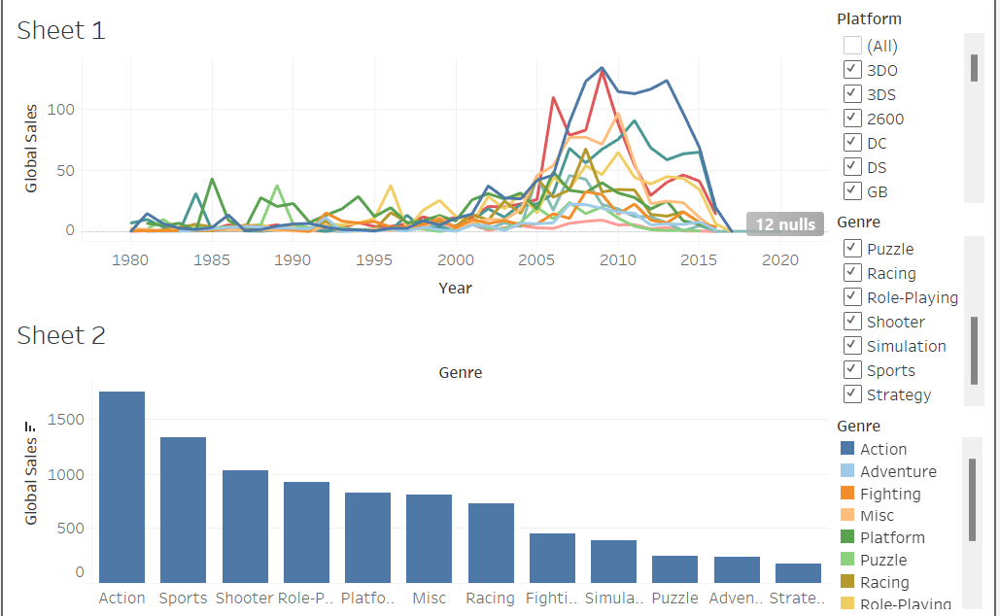

### Project Overview
This project analyzes global video game sales across different genres and platforms over time. Using Tableau, the visualizations showcase key trends and insights in the video game market.

### Tools and Features
- Tableau: Used for visualizing data related to video game sales trends by genre and platform.
- Dashboard Features: Interactive charts to explore sales patterns, platform popularity over time, and genre-based sales analysis.

### Key Insights from the Dashboard
1. Sales by Platform Over Time: The line chart displays the global sales trends across different gaming platforms from 1980 to 2020. This allows for comparison of platform popularity and the identification of peak periods.
2. Top Genres by Global Sales: The bar chart highlights the genres with the highest global sales, with action, sports, and shooting games showing the largest total sales.
3. Genre and Platform Filter Options: Interactive filters enable users to isolate specific genres and platforms to observe their respective trends.

### Dashboard Preview

